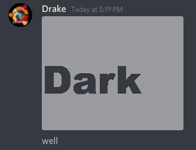
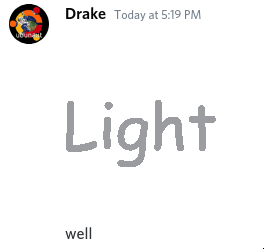

# discriminord

Create images that appear differently in Discord light and dark themes, or any
other application with two different background colors.

## Pictures

## Installation

- You can download and compile it with Cargo: `cargo install discriminord`.

- Prebuilt binaries are also available in the [GitHub releases][releases].

## How to use it

1. Pick two images, one to show to your dark mode friends, and one to show to
your light mode enemies.

  **NOTE:** Not all images are created equal; images with only two colors work
best, because there can only be two colors in the output.

2. Run `discriminord <dark-image>.png <light-image>.png <output>.png`.

3. Share with your friends.

4. Profit!

For more advanced usage, see `discriminord --help`.

## How it works

The image uses transparency to change the brightness of pixels when the color
changes. It finds the color exactly between the dark and light background
colors, and uses that as the "light" pixel color for dark mode, and the "dark"
pixel color for light mode. Then, you just have to follow a table, based on
whether the pixel needs be light or dark in each mode:

| Dark mode   | Light mode  | Output Color        | Opacity |
|-------------|-------------|---------------------|---------|
| Dark color  | Dark color  | Dark background     | 50%     |
| Light color | Light color | Light background    | 50%     |
| Dark color  | Light color |                     | 0%      |
| Light color | Dark color  | Dark/Light midpoint | 100%    |

When the semi-opaque dark color is displayed on the dark background, there is
no visible difference (same for the light color on the light background).
However, when it is displayed on the opposite background, it blends 50%/50%,
producing the midpoint color.

[releases]: https://github.com/agausmann/discriminord/releases
